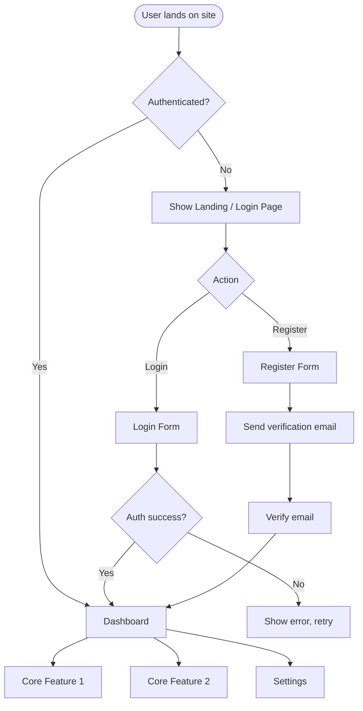
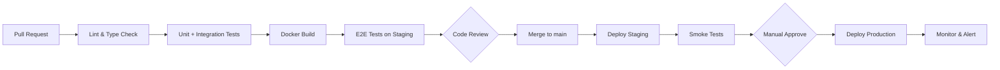

# PRD Template — Full Structure

This is the authoritative template for every PRD generated by the prd-spawnner skill.
Fill every section with specific, project-relevant content. Never use placeholder text in the output.

---

Use this exact structure in the generated .md file:

```markdown
# Product Requirements Document (PRD)

## [Product Name]

> **Version:** 1.0.0
> **Status:** Draft
> **Author:** [Author or "Generated via PRD Spawnner"]
> **Created:** [Date]
> **Last Updated:** [Date]
> **Stakeholders:** [List from interview, or "TBD"]

---

## Table of Contents

1. [Executive Summary](#1-executive-summary)
2. [Problem Statement](#2-problem-statement)
3. [Goals & Success Metrics](#3-goals--success-metrics)
4. [Target Users & Personas](#4-target-users--personas)
5. [User Stories & Use Cases](#5-user-stories--use-cases)
6. [Functional Requirements](#6-functional-requirements)
7. [Non-Functional Requirements](#7-non-functional-requirements)
8. [System Architecture](#8-system-architecture)
9. [Technology Stack](#9-technology-stack)
10. [Data Models & Database Design](#10-data-models--database-design)
11. [API Design & Contracts](#11-api-design--contracts)
12. [UI/UX Guidelines & User Flows](#12-uiux-guidelines--user-flows)
13. [Authentication & Authorization](#13-authentication--authorization)
14. [Security Requirements](#14-security-requirements)
15. [Infrastructure & DevOps](#15-infrastructure--devops)
16. [Testing Strategy](#16-testing-strategy)
17. [Monitoring, Logging & Observability](#17-monitoring-logging--observability)
18. [Error Handling & Resilience](#18-error-handling--resilience)
19. [Integrations & Third-Party Services](#19-integrations--third-party-services)
20. [Feature Roadmap & Milestones](#20-feature-roadmap--milestones)
21. [Risks & Mitigation Strategies](#21-risks--mitigation-strategies)
22. [Compliance & Legal Considerations](#22-compliance--legal-considerations)
23. [Assumptions & Constraints](#23-assumptions--constraints)
24. [Open Questions](#24-open-questions)
25. [Glossary](#25-glossary)
26. [Appendix](#26-appendix)

---

## 1. Executive Summary

[2-4 paragraphs. What is the product, why does it exist, who is it for, and what is the core value proposition. Write this as if the reader has zero context. This section should stand alone as a pitch.]

**Core Value Proposition:** [One bold sentence that nails what makes this product worth building]

**Product Vision:** [Where this product is headed in 2-3 years]

**Out of Scope (v1):** [Explicit list of things NOT included in the first version. This is as important as what IS included.]

---

## 2. Problem Statement

### 2.1 Current Pain Points

[Describe the problem from the user's perspective. Be specific. Use numbers where possible.]

| Pain Point | Severity     | Frequency    | Current Workaround  |
| ---------- | ------------ | ------------ | ------------------- |
| [pain 1]   | High/Med/Low | Daily/Weekly | [what users do now] |
| [pain 2]   | ...          | ...          | ...                 |

### 2.2 Root Cause Analysis

[Why do these problems exist? What systemic issue does this product solve?]

### 2.3 Market Opportunity

[Why now? Why is this the right time to build this?]

**Competitive Landscape:**

| Competitor | Strengths | Weaknesses | Our Differentiation |
| ---------- | --------- | ---------- | ------------------- |
| [name]     | [list]    | [list]     | [list]              |

---

## 3. Goals & Success Metrics

### 3.1 Product Goals

**Primary Goal:** [The single most important outcome]

**Secondary Goals:**

- [Goal 2]
- [Goal 3]

### 3.2 Key Performance Indicators (KPIs)

| Metric                             | Baseline | Target (3mo) | Target (6mo) | Target (12mo) |
| ---------------------------------- | -------- | ------------ | ------------ | ------------- |
| Monthly Active Users (MAU)         | 0        | [X]          | [X]          | [X]           |
| User Retention (D7)                | —        | [X]%         | [X]%         | [X]%          |
| User Retention (D30)               | —        | [X]%         | [X]%         | [X]%          |
| Core Action Completion Rate        | —        | [X]%         | [X]%         | [X]%          |
| API Error Rate                     | —        | < 0.1%       | < 0.05%      | < 0.01%       |
| Average Response Time (p95)        | —        | < [X]ms      | < [X]ms      | < [X]ms       |
| [Business Metric: revenue/NPS/etc] | —        | [X]          | [X]          | [X]           |

### 3.3 Definition of Success

[What does "success" look like at 3 months post-launch? Be specific and measurable. This is what the team rallies around.]

---

## 4. Target Users & Personas

### 4.1 Primary Persona: [Name]

> **"[A quote this persona would say about their problem]"**

| Attribute               | Detail                                          |
| ----------------------- | ----------------------------------------------- |
| **Role / Demographics** | [e.g., "Startup founder, 25-40, tech-savvy"]    |
| **Goals**               | [What they're trying to achieve]                |
| **Frustrations**        | [What drives them crazy today]                  |
| **Tech Comfort**        | [e.g., "High — uses multiple SaaS tools daily"] |
| **Device Usage**        | [e.g., "80% desktop, 20% mobile"]               |
| **Key Jobs-to-be-Done** | [1-3 specific jobs]                             |

**Behaviors:**

- [Behavior 1]
- [Behavior 2]

**How our product helps:**
[Direct connection between persona pain and product solution]

### 4.2 Secondary Persona: [Name]

[Repeat structure above for secondary user type]

### 4.3 Anti-Persona (Who We're NOT Building For)

[Explicitly define who this product is not designed for. This prevents scope creep.]

---

## 5. User Stories & Use Cases

### 5.1 Epic Overview

| Epic     | Description   | Priority | Estimated Effort |
| -------- | ------------- | -------- | ---------------- |
| [Epic 1] | [Description] | P0       | [S/M/L/XL]       |
| [Epic 2] | [Description] | P1       | [S/M/L/XL]       |
| [Epic 3] | [Description] | P2       | [S/M/L/XL]       |

_Priority: P0 = Launch blocker, P1 = Launch target, P2 = Post-launch_

### 5.2 Detailed User Stories

#### Epic 1: [Epic Name]

**US-001: [Story Name]**
```

As a [persona],
I want to [action],
So that [benefit/outcome].

```

**Acceptance Criteria:**
- [ ] [Criterion 1 — specific and testable]
- [ ] [Criterion 2]
- [ ] [Criterion 3]
- [ ] [Edge case: what happens when X fails or is missing]

**Notes:** [Any implementation hints or constraints]

---

**US-002: [Story Name]**
```

As a [persona],
I want to [action],
So that [benefit/outcome].

````

**Acceptance Criteria:**
- [ ] [Criterion 1]
- [ ] [Criterion 2]

[Continue for all P0/P1 user stories — include at least 8-12 detailed stories]

### 5.3 Core Use Case Walkthroughs

#### Use Case 1: [Happy Path Name]

**Actor:** [Persona]
**Precondition:** [What must be true before this starts]
**Goal:** [What the user is trying to accomplish]

**Main Flow:**
1. User [action]
2. System [response]
3. User [action]
4. System [response]
5. [Continue until goal is achieved]

**Alternate Flows:**
- **Alt 3a:** If [condition], then [system does X]
- **Alt 4a:** If [condition], then [user sees Y]

**Exception Flows:**
- **Exc 2a:** If [error condition], system [shows error / rolls back / notifies]

**Postcondition:** [What is true after successful completion]

---

## 6. Functional Requirements

### 6.1 Requirement Priority Matrix

| ID | Requirement | Priority | Complexity | Owner |
|----|-------------|----------|------------|-------|
| FR-001 | [Requirement] | P0 | Low/Med/High | [Role] |
| FR-002 | [Requirement] | P0 | ... | ... |

### 6.2 Core Features (P0 — Must Have at Launch)

#### Feature: [Feature Name]

**Description:** [What it does, from the user's perspective]

**Functional Requirements:**
- FR-001: [The system shall...]
- FR-002: [The system shall...]
- FR-003: [The system shall allow users to...]

**Business Rules:**
- [Rule 1: e.g., "A user may have at most 5 active projects on the free tier"]
- [Rule 2: e.g., "Prices must be recalculated whenever cart contents change"]

**Data Requirements:**
- [Data needed to power this feature]
- [Retention rules for this data]

**Validation Rules:**
- [Input validation: e.g., "Email must be RFC 5322 compliant"]
- [Business validation: e.g., "Cannot delete an account with active subscriptions"]

[Repeat for each core feature]

### 6.3 Secondary Features (P1 — Target for Launch)

[Brief descriptions of P1 features with key requirements]

### 6.4 Future Features (P2 — Post-Launch Backlog)

[Brief list of features explicitly scoped out of v1 but planned]

---

## 7. Non-Functional Requirements

### 7.1 Performance Requirements

| Requirement | Target | Measurement Method |
|-------------|--------|--------------------|
| API response time (p50) | < 100ms | APM tooling |
| API response time (p95) | < 200ms | APM tooling |
| API response time (p99) | < 500ms | APM tooling |
| Page load time (LCP) | < 2.5s | Core Web Vitals |
| Time to Interactive (TTI) | < 3.5s | Core Web Vitals |
| Throughput | [X] req/sec sustained | Load testing |
| Database query time (p95) | < 50ms | DB monitoring |

### 7.2 Scalability Requirements

| Dimension | Launch Target | 6-Month Target | 12-Month Target |
|-----------|--------------|----------------|-----------------|
| Concurrent users | [X] | [X] | [X] |
| Monthly active users | [X] | [X] | [X] |
| Data volume | [X] GB | [X] GB | [X] TB |
| API calls/day | [X] | [X] | [X] |

**Horizontal Scaling Strategy:** [How the system scales out — stateless services, DB read replicas, etc.]

**Vertical Scaling Limits:** [When horizontal scaling kicks in vs. vertical]

### 7.3 Availability & Reliability

| Requirement | Target |
|-------------|--------|
| Uptime SLA | 99.9% (< 8.7 hrs downtime/year) |
| Recovery Time Objective (RTO) | < [X] minutes |
| Recovery Point Objective (RPO) | < [X] minutes |
| Mean Time to Detect (MTTD) | < [X] minutes |
| Mean Time to Recover (MTTR) | < [X] minutes |

**Failure Mode Strategy:**
- Circuit breakers on all external service calls
- Graceful degradation: [describe what partial failure looks like to the user]
- Retry policies: exponential backoff with jitter, max [X] retries

### 7.4 Security Requirements

[See Section 14 for full detail]

### 7.5 Usability Requirements

- WCAG 2.1 Level AA accessibility compliance
- Mobile-responsive (if web): all core flows functional on 375px viewport
- Localization: [languages to support at launch vs. later]
- Browser support: [list of browsers and minimum versions]

### 7.6 Maintainability Requirements

- Code coverage target: > [X]% on critical paths
- Cyclomatic complexity: < [X] per function
- Documentation: all public APIs documented with OpenAPI 3.0
- Dependency updates: automated scanning via Dependabot or equivalent

---

## 8. System Architecture

### 8.1 Architecture Overview

[Description of the architectural pattern: Monolith / Modular Monolith / Microservices / Event-driven / Serverless / etc. and WHY this pattern fits this product at this stage]

**Key Architectural Decisions:**

| Decision | Option Chosen | Rationale | Trade-offs |
|----------|--------------|-----------|------------|
| [e.g., Architecture pattern] | [e.g., Modular Monolith] | [Why] | [What we're giving up] |
| [e.g., Database strategy] | [e.g., Single PostgreSQL] | [Why] | [What we're giving up] |

### 8.2 System Architecture Diagram

```mermaid
graph LR
  Client["🖥️ Client\n(Web / Mobile)"]
  CDN["CDN\n(Static Assets)"]
  LB["Load Balancer"]
  API["API Server\n(Backend)"]
  Auth["Auth Service"]
  DB[("Primary DB\n(PostgreSQL)")]
  Cache[("Cache\n(Redis)")]
  Queue["Message Queue"]
  Worker["Background Worker"]
  Storage["Object Storage\n(S3 / GCS)"]
  External["External APIs"]

  Client -->|HTTPS| CDN
  Client -->|HTTPS REST/GraphQL| LB
  LB --> API
  API --> Auth
  API --> DB
  API --> Cache
  API --> Queue
  API --> Storage
  API --> External
  Queue --> Worker
  Worker --> DB
  Worker --> External
````

### 8.3 Component Descriptions

| Component         | Responsibility                                        | Technology                     |
| ----------------- | ----------------------------------------------------- | ------------------------------ |
| Client            | [User interface, state management]                    | [e.g., React + TanStack Query] |
| API Server        | [Business logic, request handling]                    | [e.g., Node.js + Fastify]      |
| Auth Service      | [Token validation, session management]                | [e.g., Auth0 / Supabase Auth]  |
| Primary Database  | [Persistent data storage]                             | [e.g., PostgreSQL 16]          |
| Cache             | [Session storage, query caching, rate limit counters] | [e.g., Redis 7]                |
| Message Queue     | [Async job dispatching]                               | [e.g., BullMQ / SQS]           |
| Background Worker | [Email sending, data processing, webhooks]            | [e.g., Node.js worker]         |
| Object Storage    | [File uploads, media assets]                          | [e.g., AWS S3]                 |

### 8.4 Data Flow — Core Request Lifecycle

```mermaid
sequenceDiagram
  participant C as Client
  participant LB as Load Balancer
  participant API as API Server
  participant Cache as Redis Cache
  participant DB as PostgreSQL
  participant Q as Queue

  C->>LB: HTTPS Request (with JWT)
  LB->>API: Forward request
  API->>API: Validate JWT, extract claims
  API->>Cache: Check cache (GET key)
  alt Cache Hit
    Cache-->>API: Cached response
    API-->>C: 200 OK (from cache)
  else Cache Miss
    API->>DB: Query data
    DB-->>API: Result rows
    API->>Cache: SET key (TTL: 5min)
    API-->>C: 200 OK (from DB)
  end
  API->>Q: Dispatch async job (if needed)
```

### 8.5 Deployment Architecture

[Description of how the system is deployed — containers, cloud regions, CDN configuration]

---

## 9. Technology Stack

### 9.1 Selected Stack

| Layer                   | Technology                            | Version      | Rationale                         |
| ----------------------- | ------------------------------------- | ------------ | --------------------------------- |
| **Frontend Framework**  | [e.g., Next.js]                       | [e.g., 14.x] | [Why]                             |
| **Frontend Language**   | TypeScript                            | 5.x          | Type safety, developer experience |
| **UI Components**       | [e.g., shadcn/ui + Tailwind CSS]      | Latest       | [Why]                             |
| **State Management**    | [e.g., Zustand / TanStack Query]      | Latest       | [Why]                             |
| **Backend Framework**   | [e.g., Fastify / Express / NestJS]    | [version]    | [Why]                             |
| **Backend Language**    | TypeScript / Python / Go              | [version]    | [Why]                             |
| **ORM / Query Builder** | [e.g., Drizzle ORM / Prisma]          | Latest       | [Why]                             |
| **Primary Database**    | PostgreSQL                            | 16.x         | ACID compliance, JSON support     |
| **Cache**               | Redis                                 | 7.x          | Low latency, pub/sub support      |
| **Auth**                | [e.g., Clerk / Auth0 / Supabase Auth] | Latest       | [Why]                             |
| **File Storage**        | AWS S3 / Cloudflare R2                | —            | [Why]                             |
| **Email**               | [e.g., Resend / SendGrid]             | —            | [Why]                             |
| **Hosting (Frontend)**  | [e.g., Vercel / Cloudflare Pages]     | —            | [Why]                             |
| **Hosting (Backend)**   | [e.g., Railway / Render / AWS ECS]    | —            | [Why]                             |
| **CI/CD**               | GitHub Actions                        | —            | [Why]                             |
| **Monitoring**          | [e.g., Sentry + Grafana / Datadog]    | —            | [Why]                             |

### 9.2 Development Tooling

| Tool                 | Purpose                       |
| -------------------- | ----------------------------- |
| ESLint + Prettier    | Code quality and formatting   |
| Husky + lint-staged  | Pre-commit hooks              |
| Vitest / Jest        | Unit & integration testing    |
| Playwright / Cypress | E2E testing                   |
| Docker Compose       | Local development environment |
| GitHub Actions       | CI/CD pipeline                |

### 9.3 Stack Rationale & Alternatives Considered

[Brief justification of the stack decisions, especially if non-obvious. Note which alternatives were considered and why they were rejected.]

---

## 10. Data Models & Database Design

### 10.1 Core Entity Relationship Diagram

```mermaid
erDiagram
  USER {
    uuid id PK
    string email UK
    string name
    enum role
    boolean is_verified
    timestamp created_at
    timestamp updated_at
    timestamp deleted_at
  }

  [ENTITY_2] {
    uuid id PK
    uuid user_id FK
    string [field]
    enum status
    jsonb metadata
    timestamp created_at
    timestamp updated_at
  }

  [ENTITY_3] {
    uuid id PK
    uuid [entity_2_id] FK
    string [field]
    timestamp created_at
  }

  USER ||--o{ [ENTITY_2] : "owns"
  [ENTITY_2] ||--o{ [ENTITY_3] : "contains"
```

### 10.2 Data Model Details

#### Table: `users`

| Column          | Type                   | Constraints                   | Description           |
| --------------- | ---------------------- | ----------------------------- | --------------------- |
| `id`            | `UUID`                 | PK, DEFAULT gen_random_uuid() | Primary key           |
| `email`         | `VARCHAR(255)`         | UNIQUE, NOT NULL              | User's email address  |
| `name`          | `VARCHAR(255)`         | NOT NULL                      | Display name          |
| `password_hash` | `VARCHAR(255)`         | NULLABLE                      | Null for OAuth users  |
| `role`          | `ENUM('user','admin')` | DEFAULT 'user'                | Authorization role    |
| `is_verified`   | `BOOLEAN`              | DEFAULT false                 | Email verified flag   |
| `avatar_url`    | `TEXT`                 | NULLABLE                      | Profile picture URL   |
| `metadata`      | `JSONB`                | DEFAULT '{}'                  | Extensible attributes |
| `created_at`    | `TIMESTAMPTZ`          | DEFAULT NOW()                 | Record creation time  |
| `updated_at`    | `TIMESTAMPTZ`          | DEFAULT NOW()                 | Last update time      |
| `deleted_at`    | `TIMESTAMPTZ`          | NULLABLE                      | Soft delete timestamp |

**Indexes:**

- `idx_users_email` ON `email` (unique)
- `idx_users_deleted_at` ON `deleted_at` (for soft delete filtering)

[Repeat table structure for all core entities]

### 10.3 Database Design Decisions

| Decision      | Choice                       | Rationale                                    |
| ------------- | ---------------------------- | -------------------------------------------- |
| ID strategy   | UUID v4                      | No sequential ID enumeration, distributable  |
| Soft deletes  | Yes (deleted_at)             | Audit trail, data recovery                   |
| Multi-tenancy | [Yes/No]                     | [How implemented if yes]                     |
| Audit logging | [Separate audit table / CDC] | [Rationale]                                  |
| JSON columns  | JSONB for metadata           | Schema flexibility for extensible attributes |
| Timestamps    | TIMESTAMPTZ                  | Timezone-aware, avoids DST bugs              |

### 10.4 Migration Strategy

- Migrations managed with [Flyway / Alembic / Drizzle migrations / Prisma migrate]
- All schema changes via versioned migrations — no manual DDL in production
- Backward-compatible migrations: add columns with defaults before removing old ones
- Blue-green migration strategy for zero-downtime deployments

### 10.5 Data Retention Policy

| Data Type        | Retention Period                 | Deletion Strategy         |
| ---------------- | -------------------------------- | ------------------------- |
| User accounts    | Until account deletion + 30 days | Soft delete → hard delete |
| [Entity 2]       | [Period]                         | [Strategy]                |
| Application logs | 90 days                          | Automated purge           |
| Audit logs       | 7 years                          | Archive to cold storage   |
| Analytics events | 2 years                          | Aggregate → delete raw    |

---

## 11. API Design & Contracts

### 11.1 API Design Principles

- **Style:** RESTful JSON API (or GraphQL if specified)
- **Versioning:** URI versioning (`/api/v1/...`) — no sunset without 6-month notice
- **Authentication:** Bearer JWT in Authorization header
- **Content-Type:** `application/json` for all endpoints
- **Pagination:** Cursor-based for large datasets, offset for small
- **Error format:** RFC 7807 Problem Details

### 11.2 Base URL Structure

```
Production:  https://api.[domain].com/v1
Staging:     https://api-staging.[domain].com/v1
Local:       http://localhost:3000/api/v1
```

### 11.3 Standard Response Format

**Success:**

```json
{
  "data": { ... },
  "meta": {
    "request_id": "req_01HX...",
    "timestamp": "2025-01-15T10:30:00Z"
  }
}
```

**Paginated List:**

```json
{
  "data": [...],
  "pagination": {
    "cursor": "eyJpZCI6IjEyMyJ9",
    "has_next": true,
    "total": 1042
  },
  "meta": { "request_id": "...", "timestamp": "..." }
}
```

**Error (RFC 7807):**

```json
{
    "type": "https://api.[domain].com/errors/validation-error",
    "title": "Validation Error",
    "status": 422,
    "detail": "The email field must be a valid email address.",
    "instance": "/api/v1/auth/register",
    "errors": [{ "field": "email", "message": "Must be a valid email address" }],
    "request_id": "req_01HX..."
}
```

### 11.4 API Endpoints

#### Authentication

```
POST   /api/v1/auth/register     Register new user
POST   /api/v1/auth/login        Login with credentials
POST   /api/v1/auth/logout       Invalidate session
POST   /api/v1/auth/refresh      Refresh access token
POST   /api/v1/auth/forgot       Request password reset
POST   /api/v1/auth/reset        Complete password reset
GET    /api/v1/auth/me           Get current user profile
```

**POST /api/v1/auth/register**

Request:

```json
{
    "name": "string (3-100 chars, required)",
    "email": "string (valid email, required)",
    "password": "string (min 8 chars, 1 uppercase, 1 number, required)"
}
```

Response `201 Created`:

```json
{
    "data": {
        "user": {
            "id": "uuid",
            "name": "string",
            "email": "string",
            "is_verified": false,
            "created_at": "ISO 8601 datetime"
        },
        "tokens": {
            "access_token": "JWT (expires: 15min)",
            "refresh_token": "opaque token (expires: 30 days)"
        }
    }
}
```

Error cases:

- `409 Conflict` — email already registered
- `422 Unprocessable Entity` — validation failure

[Repeat for all core endpoints with request/response contracts]

#### [Resource Name]

```
GET    /api/v1/[resources]           List (paginated)
POST   /api/v1/[resources]           Create
GET    /api/v1/[resources]/:id       Get by ID
PUT    /api/v1/[resources]/:id       Full update
PATCH  /api/v1/[resources]/:id       Partial update
DELETE /api/v1/[resources]/:id       Soft delete
```

### 11.5 Rate Limiting

| Tier                 | Limit    | Window     | Scope    |
| -------------------- | -------- | ---------- | -------- |
| Unauthenticated      | 20 req   | 1 minute   | per IP   |
| Authenticated (free) | 100 req  | 1 minute   | per user |
| Authenticated (pro)  | 1000 req | 1 minute   | per user |
| Auth endpoints       | 5 req    | 15 minutes | per IP   |

Rate limit headers:

```
X-RateLimit-Limit: 100
X-RateLimit-Remaining: 87
X-RateLimit-Reset: 1737000000
Retry-After: 47  (on 429 response)
```

### 11.6 Webhooks (if applicable)

[Webhook event types, payload format, signature verification, retry policy]

---

## 12. UI/UX Guidelines & User Flows

### 12.1 Design System

| Element        | Specification                   |
| -------------- | ------------------------------- |
| Typography     | [Font family, scale]            |
| Primary Color  | [Hex / design token]            |
| Spacing System | [4px / 8px base grid]           |
| Border Radius  | [e.g., 6px default, 12px cards] |
| Shadow System  | [Levels: sm, md, lg]            |
| Breakpoints    | 375px / 768px / 1280px / 1440px |

### 12.2 Core User Flow Diagram



### 12.3 Key Screen Descriptions

#### Screen: [Screen Name]

**Purpose:** [What user is trying to do on this screen]

**Layout:** [Description of layout — sidebar, content area, header, etc.]

**Key Elements:**

- [Element 1]: [Description and behavior]
- [Element 2]: [Description and behavior]
- [CTA]: [Primary action and what it triggers]

**Empty States:** [What the user sees when there's no data]

**Loading States:** [How loading is handled — skeleton screens, spinners]

**Error States:** [How errors surface — toast, inline, banner]

[Repeat for all core screens]

### 12.4 Responsive Design Guidelines

| Breakpoint          | Layout Behavior                                     |
| ------------------- | --------------------------------------------------- |
| Mobile (< 768px)    | Single column, bottom nav bar, collapsible sections |
| Tablet (768-1280px) | Two column where appropriate, side drawer nav       |
| Desktop (> 1280px)  | Full sidebar, multi-column layouts                  |

---

## 13. Authentication & Authorization

### 13.1 Authentication Strategy

**Method:** [JWT / Session / OAuth2 / etc.]

**Token Strategy:**

- Access Token: JWT, signed with RS256, expires in 15 minutes
- Refresh Token: Opaque random token, stored in DB, expires in 30 days
- Rotation: Refresh tokens rotate on each use (detect reuse = revoke all)

**OAuth Providers (if applicable):**

- [e.g., Google OAuth2, GitHub OAuth]
- PKCE flow for all OAuth flows
- State parameter to prevent CSRF

### 13.2 Authorization Model

**Model:** [RBAC / ABAC / Permissions-based]

**Roles:**

| Role          | Description    | Key Permissions     |
| ------------- | -------------- | ------------------- |
| `user`        | Standard user  | Own data CRUD       |
| `admin`       | Platform admin | All data read/write |
| [Custom role] | [Description]  | [Permissions]       |

**Permission Matrix:**

| Resource       | user      | admin   |
| -------------- | --------- | ------- |
| Own profile    | CRUD      | CRUD    |
| Other profiles | Read only | CRUD    |
| [Resource]     | [perms]   | [perms] |

### 13.3 Session Management

- Server-side session invalidation on logout
- Concurrent session limit: [X] active sessions per user
- Suspicious login detection: new country/device triggers email notification
- MFA: [Optional at launch / Enforced for admin roles]

---

## 14. Security Requirements

### 14.1 Security Principles

- Defense in depth — multiple layers of protection
- Least privilege — every component gets minimum required access
- Zero trust — verify at every boundary, don't trust internal networks implicitly
- Secure by default — insecure configurations must be explicitly opted into

### 14.2 Input Validation & Sanitization

- All user input validated at the API boundary (server-side)
- Schema validation using [Zod / Joi / yup / class-validator]
- No client-side-only validation — always mirror on server
- HTML sanitization for any rich text fields using DOMPurify or equivalent
- SQL injection prevention via parameterized queries only — never string concatenation
- File upload validation: type whitelist, size limits, malware scanning

### 14.3 OWASP Top 10 Mitigations

| Threat                         | Mitigation                                                                            |
| ------------------------------ | ------------------------------------------------------------------------------------- |
| A01: Broken Access Control     | Row-level security checks, RBAC enforcement at middleware layer                       |
| A02: Cryptographic Failures    | TLS 1.3 everywhere, bcrypt for passwords (cost factor ≥ 12), AES-256 for data at rest |
| A03: Injection                 | Parameterized queries, ORM usage, input sanitization                                  |
| A04: Insecure Design           | Threat modeling, secure SDLC                                                          |
| A05: Security Misconfiguration | IaC with reviewed configs, secrets in vault not env files                             |
| A06: Vulnerable Components     | Dependabot, weekly dependency audits                                                  |
| A07: Auth Failures             | JWT short expiry, refresh token rotation, rate limiting                               |
| A08: Integrity Failures        | Subresource Integrity (SRI) for CDN assets, signed deployments                        |
| A09: Logging Failures          | Structured logging, security events audited                                           |
| A10: SSRF                      | Allowlist for outbound URLs, no user-controlled fetch targets                         |

### 14.4 Data Protection

- PII fields identified and encrypted at rest where needed
- Data minimization: collect only what's necessary
- Secrets: stored in [AWS Secrets Manager / HashiCorp Vault / Doppler]
- No secrets in source code or version control (enforced via git-secrets hook)

### 14.5 Security Headers

All HTTP responses include:

```
Strict-Transport-Security: max-age=31536000; includeSubDomains; preload
X-Content-Type-Options: nosniff
X-Frame-Options: DENY
Content-Security-Policy: default-src 'self'; ...
Referrer-Policy: strict-origin-when-cross-origin
Permissions-Policy: camera=(), microphone=(), geolocation=()
```

---

## 15. Infrastructure & DevOps

### 15.1 Environment Strategy

| Environment  | Purpose             | Data                  | Access     |
| ------------ | ------------------- | --------------------- | ---------- |
| `local`      | Developer machines  | Seed data             | Developer  |
| `staging`    | Pre-release testing | Anonymized prod clone | Team + QA  |
| `production` | Live users          | Real data             | CI/CD only |

### 15.2 Infrastructure as Code

All infrastructure defined in code ([Terraform / Pulumi / CDK]).
No manual cloud console changes — all changes via PR and review.

**Cloud Provider:** [AWS / GCP / Azure / Cloudflare]

**Key Resources:**

- Compute: [e.g., AWS ECS Fargate / Fly.io / Railway]
- Database: [e.g., AWS RDS PostgreSQL with Multi-AZ]
- Cache: [e.g., AWS ElastiCache Redis]
- CDN: [e.g., Cloudflare / AWS CloudFront]
- DNS: [e.g., Cloudflare]
- Secrets: [e.g., AWS Secrets Manager]

### 15.3 CI/CD Pipeline



**Branch Strategy:**

- `main` → production-ready code
- `develop` → integration branch (if team > 3)
- Feature branches: `feat/[ticket-id]-description`
- Hotfix branches: `hotfix/[issue]-description`

**Deployment Strategy:** [Blue-Green / Canary / Rolling]

### 15.4 Container Strategy

```dockerfile
# Example: multi-stage build for minimal production image
FROM node:20-alpine AS builder
# build stage...

FROM node:20-alpine AS production
# production stage — no dev dependencies, minimal attack surface
```

- Base images: Alpine or Distroless — minimal attack surface
- Non-root user in containers
- Read-only filesystem where possible
- Health checks defined in Dockerfile and orchestrator

### 15.5 Backup & Disaster Recovery

| Component      | Backup Frequency                | Retention  | RTO   | RPO  |
| -------------- | ------------------------------- | ---------- | ----- | ---- |
| PostgreSQL     | Continuous WAL + daily snapshot | 30 days    | 1hr   | 5min |
| Redis          | Daily RDB snapshot              | 7 days     | 15min | 1hr  |
| Object Storage | Cross-region replication        | Indefinite | 5min  | ~0   |

Backup restoration tested quarterly.

---

## 16. Testing Strategy

### 16.1 Testing Pyramid

| Layer             | Coverage Target                  | Tools                  | What's Tested                       |
| ----------------- | -------------------------------- | ---------------------- | ----------------------------------- |
| Unit Tests        | ≥ 80% (critical paths)           | Vitest / Jest          | Business logic, utils, calculations |
| Integration Tests | Core API flows                   | Vitest + Supertest     | API endpoints, DB operations        |
| E2E Tests         | Happy path + critical user flows | Playwright             | Full user journeys                  |
| Visual Regression | Key screens                      | Playwright screenshots | UI consistency                      |
| Load Testing      | Pre-launch + monthly             | k6 / Artillery         | Performance under load              |
| Security Testing  | Per release                      | OWASP ZAP / Snyk       | Vulnerability scanning              |

### 16.2 Test Environment Setup

```bash
# Isolated test database per test suite run
DATABASE_URL=postgresql://localhost:5432/[product]_test

# Docker Compose services for integration tests
docker compose -f docker-compose.test.yml up -d
```

### 16.3 Critical Test Cases

[List the most important test scenarios to cover — at minimum the acceptance criteria from P0 user stories]

### 16.4 Quality Gates

All of these must pass before merge to `main`:

- [ ] Lint: zero errors
- [ ] Type check: zero errors
- [ ] Unit tests: all pass, coverage ≥ target
- [ ] Integration tests: all pass
- [ ] No new critical/high Snyk vulnerabilities
- [ ] Bundle size regression: < [X]% increase

All of these must pass before production deploy:

- [ ] E2E tests on staging: all pass
- [ ] Smoke tests post-deploy: all pass
- [ ] Error rate: < 0.1% in first 10 minutes

---

## 17. Monitoring, Logging & Observability

### 17.1 Observability Pillars

**Metrics (RED Method):**

- Rate: requests per second
- Errors: error rate per endpoint
- Duration: p50/p95/p99 latency

**Logs (Structured JSON):**

```json
{
    "timestamp": "ISO 8601",
    "level": "info|warn|error",
    "request_id": "req_01HX...",
    "user_id": "uuid or null",
    "service": "api",
    "message": "...",
    "duration_ms": 42,
    "status_code": 200,
    "path": "/api/v1/...",
    "error": null
}
```

**Traces:** Distributed tracing via [OpenTelemetry / Datadog APM]

### 17.2 Alerting Rules

| Alert                    | Threshold      | Severity | Action              |
| ------------------------ | -------------- | -------- | ------------------- |
| Error rate               | > 1% for 5min  | Critical | Page on-call        |
| API p95 latency          | > 1s for 5min  | Warning  | Notify team         |
| Database connection pool | > 80% for 2min | Warning  | Auto-scale          |
| Disk usage               | > 85%          | Warning  | Notify + plan       |
| Failed login spike       | > 50 in 1min   | Critical | Notify + auto-block |
| Certificate expiry       | < 14 days      | Warning  | Renew               |

### 17.3 Dashboards

- **Service Health:** Error rate, latency, throughput, saturation
- **Business Metrics:** Signups, DAU/MAU, core action completions
- **Infrastructure:** CPU, memory, disk, network per service
- **Database:** Query time, connection pool, replication lag

---

## 18. Error Handling & Resilience

### 18.1 Error Taxonomy

| HTTP Status | Error Type            | When to Use                            |
| ----------- | --------------------- | -------------------------------------- |
| 400         | Bad Request           | Malformed request syntax               |
| 401         | Unauthorized          | Missing or invalid auth                |
| 403         | Forbidden             | Authenticated but not authorized       |
| 404         | Not Found             | Resource doesn't exist                 |
| 409         | Conflict              | State conflict (duplicate email, etc.) |
| 422         | Unprocessable Entity  | Validation failure                     |
| 429         | Too Many Requests     | Rate limit exceeded                    |
| 500         | Internal Server Error | Unexpected server error                |
| 502         | Bad Gateway           | Upstream service failure               |
| 503         | Service Unavailable   | System overloaded / maintenance        |

### 18.2 Resilience Patterns

**Retry Policy:**

```
Max retries: 3
Backoff: exponential with jitter
Initial delay: 100ms
Max delay: 5000ms
Retryable errors: 429, 502, 503, 504, network timeouts
Non-retryable: 4xx (except 429)
```

**Circuit Breaker (per external service):**

- Threshold: 50% failure rate over 10 requests
- Open duration: 30 seconds
- Half-open: 1 probe request
- Fallback: [graceful degradation behavior]

**Timeout Strategy:**
| Operation | Timeout |
|-----------|---------|
| External HTTP calls | 5 seconds |
| Database queries | 10 seconds |
| Background jobs | 30 seconds |
| File upload processing | 2 minutes |

### 18.3 User-Facing Error Messages

Never expose: stack traces, SQL errors, internal service names, file paths

Error message format:

- Clear description of what went wrong
- What the user can do about it
- A request_id they can provide to support

---

## 19. Integrations & Third-Party Services

### 19.1 Integration Map

| Service             | Purpose               | Criticality | Fallback Strategy |
| ------------------- | --------------------- | ----------- | ----------------- |
| [Auth provider]     | User authentication   | Critical    | Maintenance page  |
| [Payment processor] | Subscriptions         | Critical    | Queue + retry     |
| [Email service]     | Transactional email   | High        | Failover SMTP     |
| [Analytics]         | Product analytics     | Low         | Log to DB         |
| [CDN]               | Static asset delivery | High        | Origin server     |

### 19.2 Integration Details

#### [Service Name]

**SDK / API Version:** [version]
**Authentication:** [how authenticated — API key in env var, OAuth, etc.]
**Rate Limits:** [service's rate limits]
**Webhook events consumed:** [list if applicable]
**Failure behavior:** [what happens when this service is down]
**Data sent:** [what user data is sent to this service — for compliance]

---

## 20. Feature Roadmap & Milestones

### 20.1 Release Plan

#### 🚀 v1.0 — MVP Launch (Target: [Date])

**Goal:** [What this milestone achieves]

**Features Included:**

- [Feature 1] (Est: [X] days)
- [Feature 2] (Est: [X] days)
- [Feature 3] (Est: [X] days)

**Exit Criteria:**

- All P0 user stories complete
- E2E tests passing
- Load test: [X] concurrent users
- Security audit: no critical/high findings

**Estimated effort:** [X] weeks, [X] person-days

---

#### 📈 v1.1 — Growth Phase (Target: [Date + 6wk])

**Goal:** [Improve retention, fill gaps from user feedback]

**Features Included:**

- [Feature from P1 backlog]
- [Feature from P1 backlog]

---

#### 🏗️ v2.0 — Scale Phase (Target: [Date + 3mo])

**Goal:** [Handle growth, new market segments, enterprise features]

**Features Included:**

- [P2 features worth prioritizing]

### 20.2 Sprint Breakdown (v1.0)

| Sprint              | Focus                   | Deliverables                            |
| ------------------- | ----------------------- | --------------------------------------- |
| Sprint 1 (Wk 1-2)   | Foundation              | Auth, DB schema, CI/CD, skeleton        |
| Sprint 2 (Wk 3-4)   | Core Feature 1          | [Feature] backend + frontend            |
| Sprint 3 (Wk 5-6)   | Core Feature 2          | [Feature] backend + frontend            |
| Sprint 4 (Wk 7-8)   | Core Feature 3 + Polish | [Feature], error states, loading states |
| Sprint 5 (Wk 9-10)  | QA + Security           | Testing, fixes, audit                   |
| Sprint 6 (Wk 11-12) | Launch Prep             | Monitoring, docs, soft launch           |

---

## 21. Risks & Mitigation Strategies

### 21.1 Risk Register

| ID  | Risk                                 | Probability | Impact   | Severity    | Mitigation                                    |
| --- | ------------------------------------ | ----------- | -------- | ----------- | --------------------------------------------- |
| R01 | Scope creep delays launch            | High        | High     | 🔴 Critical | Strict P0/P1/P2 classification, weekly review |
| R02 | Key dependency (auth/payment) outage | Low         | High     | 🟡 High     | Fallback plan + SLA review                    |
| R03 | Performance under unexpected load    | Medium      | High     | 🟡 High     | Load testing pre-launch, auto-scaling         |
| R04 | Security breach / data leak          | Low         | Critical | 🔴 Critical | Security audit, pen test, encryption          |
| R05 | Poor user adoption                   | Medium      | High     | 🟡 High     | User testing pre-launch, feedback loop        |
| R06 | Technical debt accumulating          | High        | Medium   | 🟡 High     | Definition of Done includes refactoring       |
| R07 | Developer turnover                   | Low         | High     | 🟡 High     | Documentation, knowledge sharing sessions     |
| R08 | [Product-specific risk]              | [P]         | [I]      | [S]         | [Mitigation]                                  |

### 21.2 Technical Risk Deep Dive

[For the top 2-3 technical risks, provide more depth on what specifically could go wrong and what the concrete mitigation plan is]

---

## 22. Compliance & Legal Considerations

### 22.1 Applicable Regulations

| Regulation         | Applicability         | Key Requirements                                         |
| ------------------ | --------------------- | -------------------------------------------------------- |
| GDPR               | If serving EU users   | Consent, right to erasure, data portability, DPA         |
| CCPA               | If serving CA users   | Right to know, delete, opt-out of sale                   |
| [Local regulation] | [Country-specific]    | [Requirements]                                           |
| PCI-DSS            | If handling card data | Delegate to payment processor, never store raw card data |

### 22.2 Privacy Requirements

- Privacy policy must be accessible from all pages
- Cookie consent banner for non-essential cookies (if web)
- Data processing addendum (DPA) with all vendors processing PII
- Right to erasure: user account deletion must cascade to PII within 30 days

### 22.3 Terms of Service & Legal Documents

- [ ] Terms of Service
- [ ] Privacy Policy
- [ ] Cookie Policy (if applicable)
- [ ] Acceptable Use Policy
- [ ] Data Processing Agreement template (for B2B)

---

## 23. Assumptions & Constraints

### 23.1 Assumptions

[List every assumption made in writing this PRD. These should be validated.]

- [Assumption 1: e.g., "Users have reliable internet access"]
- [Assumption 2: e.g., "Target users are comfortable with email-based auth"]
- [Assumption 3: e.g., "Payment volume will not exceed X transactions/day in year 1"]

### 23.2 Constraints

**Technical Constraints:**

- [e.g., "Must integrate with existing legacy system via REST"]
- [e.g., "Mobile app must support iOS 15+ and Android 10+"]

**Business Constraints:**

- [e.g., "Launch must happen before [event/competitor launch]"]
- [e.g., "Budget for third-party services: < $X/month at launch"]

**Team Constraints:**

- [e.g., "Team of [X] developers available from [date]"]
- [e.g., "No dedicated DevOps — must use managed services"]

---

## 24. Open Questions

[Track all unresolved questions. Assign owners and target resolution dates.]

| #   | Question   | Owner  | Target Date | Status         |
| --- | ---------- | ------ | ----------- | -------------- |
| Q1  | [Question] | [Name] | [Date]      | 🔴 Open        |
| Q2  | [Question] | [Name] | [Date]      | 🟡 In Progress |

---

## 25. Glossary

| Term     | Definition                            |
| -------- | ------------------------------------- |
| [Term 1] | [Definition]                          |
| [Term 2] | [Definition]                          |
| MAU      | Monthly Active Users                  |
| DAU      | Daily Active Users                    |
| p95      | 95th percentile (e.g., response time) |
| RTO      | Recovery Time Objective               |
| RPO      | Recovery Point Objective              |
| RBAC     | Role-Based Access Control             |
| JWT      | JSON Web Token                        |
| PII      | Personally Identifiable Information   |

---

## 26. Appendix

### A. Decision Log

[Track major decisions made during PRD creation and why]

| Date   | Decision   | Rationale | Alternatives Rejected      |
| ------ | ---------- | --------- | -------------------------- |
| [Date] | [Decision] | [Why]     | [What else was considered] |

### B. References

- [Link to design mockups / Figma]
- [Link to technical spike results]
- [Link to competitor analysis]
- [Link to user research]

### C. Revision History

| Version | Date   | Author   | Changes       |
| ------- | ------ | -------- | ------------- |
| 1.0.0   | [Date] | [Author] | Initial draft |

---

_This document is a living artifact. Update it as decisions are made and requirements evolve._
_Last synced with engineering: [Date]_

```

```
